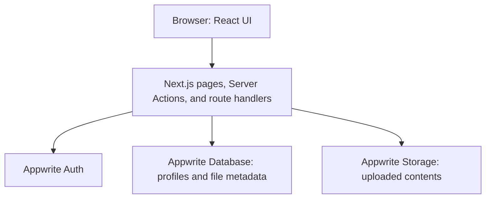

# Orion Cloud

Orion Cloud is a full-stack file management application built with Next.js, React, TypeScript, and Appwrite. Users can upload, organize, search, download, and share files through a responsive interface.

Inspired by Google Drive, this project was created to learn full-stack development through authentication, cloud storage, database operations, and reusable UI components. It is under active development.

## Features

- **Email authentication:** Sign up and sign in with email verification codes and HTTP-only session cookies.
- **Dashboard:** Recent Files shows the four newest accessible uploads. All Files displays files across categories with sorting controls and compact cards.
- **Uploads:** Select or drag and drop multiple files. A floating panel displays thumbnails, filenames, sizes, and loading indicators.
- **Categories:** Dedicated Documents, Images, Media, and Others pages.
- **Search:** Debounced search suggestions with thumbnails. Selecting a result opens its category page with that file selected; clearing the input restores the category list.
- **Sorting:** Sort by upload date, name, size, or last modification date in either direction.
- **Details:** View file format, size, timestamps, and the original uploader's email.
- **Rename:** Update a file's display name while preserving its extension.
- **Downloads:** Download through a server route that checks ownership or shared access.
- **Sharing:** Grant other Orion Cloud users access by email and remove recipients.
- **Deletion:** Owners can delete a stored file and its database document after confirmation.
- **Responsive design:** Desktop sidebar, mobile navigation, adaptive grids, action dialogs, and toast notifications.

Recent Files means recently uploaded, not recently opened. Shared files are ordered by upload date, not the date they were shared.

## Tech Stack

| Area | Technology | Purpose |
| --- | --- | --- |
| Framework | Next.js 16, App Router | Routing, server rendering, Server Actions, and route handlers |
| UI | React 19 | Components, hooks, and interactive state |
| Language | TypeScript 5 | Shared types and compile-time checks |
| Styling | Tailwind CSS 4 | Responsive layouts and utility-based styling |
| Components | shadcn/ui with Base UI | Dialogs, inputs, menus, selects, sheets, and notifications |
| Forms | React Hook Form and Zod | Form state and input validation |
| Backend services | Appwrite | Authentication, database records, and file storage |
| SDK | Node Appwrite SDK | Server-side communication with Appwrite |
| Upload interaction | React Dropzone | File selection and drag-and-drop |
| Verification input | input-otp | Verification-code entry |
| Icons | Lucide React and SVG assets | Interface icons and loading indicators |
| Typography | Ubuntu and Rokkitt via next/font | Headings and body text |
| Tooling | ESLint and Prettier | Code analysis and formatting |

The interface uses brand blue `#439ef0` with neutral grays, Ubuntu headings, and Rokkitt body text.

## Architecture

Next.js provides both the frontend and the application server. Appwrite supplies authentication, the database, and file storage. There is no separate Express backend.



### Frontend

Server-rendered pages retrieve accessible file records and pass them to reusable cards. Client Components handle uploads, search suggestions, sorting, dialogs, and forms. URL parameters preserve sorting, search, and selected-file filters.

The dashboard reuses category-page cards with more compact spacing. The desktop sidebar remains in place while the file area scrolls.

### Authentication

1. The user submits an email address; sign-up also collects a full name.
2. Appwrite sends a verification code.
3. The application verifies the code and creates a session.
4. Next.js stores the session secret in an HTTP-only cookie with `SameSite=Strict` and the secure flag enabled in production.
5. Protected layouts check the current user before rendering application pages.

The session client uses the session cookie. The admin client uses a server API key for privileged operations.

### File Storage

Uploaded bytes are saved in an Appwrite Storage bucket. Separate database documents hold filenames, types, extensions, sizes, ownership, recipient emails, and storage IDs.

If metadata creation fails after uploading, the upload action attempts to remove the stored file. Deletion removes storage first, then the document. A retry can complete document cleanup if storage is already gone.

File categories are inferred from filename extensions; this does not validate the file's contents. Successful mutations revalidate the affected page.

### Sharing

File queries include records owned by the signed-in user or shared with their normalized email address. The download route applies the same access rules. Sharing updates and deletion check ownership on the server.

Adding recipients is saved with the Share button. Removing a recipient saves immediately. The original uploader remains the owner, and Details retrieves that owner's email from their profile.

**Sharing grants access inside Orion Cloud. It does not email a picture, send an attachment, or send an invitation notification.** Recipients sign in with the listed email to access shared files. Appwrite storage permissions separately govern direct preview URLs.

## Routes

| Route | Purpose |
| --- | --- |
| `/` | Dashboard: Recent Files and All Files |
| `/documents` | Documents |
| `/images` | Images |
| `/media` | Audio and video |
| `/others` | Files outside recognized document, image, audio, and video extensions |
| `/sign-in` | Email sign-in |
| `/sign-up` | Account registration |
| `/api/files/[id]/download` | Authorized download |

Example filtered URL: `/images?query=photo.png&fileId=DOCUMENT_ID&sort=name-asc`.

## Project Structure

```text
Orion-Cloud/
├── README.md
└── orioncloud/
    ├── app/
    │   ├── (auth)/                 # Authentication pages and layout
    │   ├── (root)/
    │   │   ├── layout.tsx          # Sidebar, header, mobile navigation
    │   │   ├── page.tsx            # Dashboard
    │   │   └── [type]/page.tsx     # Shared category page
    │   ├── api/files/[id]/download/route.ts
    │   ├── globals.css
    │   └── layout.tsx              # Fonts, metadata, root layout
    ├── components/                # Application components
    │   └── ui/                    # Shared UI primitives
    ├── constants/                 # Navigation, sorting, actions, upload limit
    ├── lib/
    │   ├── actions/               # User and file Server Actions
    │   ├── appwrite/              # Configuration and client creation
    │   └── utils.ts               # File types, sizes, dates, and URLs
    ├── types/                     # Shared TypeScript interfaces
    ├── assets/                    # Imported images
    └── public/                    # Public images and icons
```

## Local Setup

Use a Node.js version compatible with the installed Next.js release, npm, and an Appwrite project configured for this application.

From the repository root:

```bash
cd orioncloud
npm ci
```

Create `orioncloud/.env.local`:

```dotenv
NEXT_PUBLIC_APPWRITE_ENDPOINT=https://YOUR_REGION.cloud.appwrite.io/v1
NEXT_PUBLIC_APPWRITE_PROJECT=your_project_id
NEXT_PUBLIC_APPWRITE_DATABASE=your_database_id
NEXT_PUBLIC_APPWRITE_USERS_TABLE=your_users_table_id
NEXT_PUBLIC_APPWRITE_FILES_TABLE=your_files_table_id
NEXT_PUBLIC_APPWRITE_BUCKET=your_storage_bucket_id
NEXT_APPWRITE_KEY=your_server_api_key
```

Use your project's actual regional endpoint. The current image configuration allows `nyc.cloud.appwrite.io`; update `next.config.ts` if your Appwrite image URLs use another hostname.

Keep `.env.local` out of version control. `NEXT_APPWRITE_KEY` is server-only and must not receive a `NEXT_PUBLIC_` prefix.

### Appwrite Configuration

Configure email verification, a database containing user and file records, and a storage bucket. API-key scopes, indexes, and permissions must support the operations used in the source code. Signed-in sessions need access to their user profile.

Although environment variables contain `TABLE`, the application uses the SDK's `Databases` document methods, such as `listDocuments` and `createDocument`, rather than `TablesDB` row methods. The configured IDs and schema must work with those calls.

| Record | Expected application fields |
| --- | --- |
| User | `fullName`, `email`, `avatar`, `accountId` |
| File | `name`, `type`, `extension`, `size`, `url`, `owner`, `accountId`, `users`, `bucketFileId` |

- `size` is a numeric byte count.
- `users` is an array of recipient email strings.
- `owner` identifies the uploader's user-profile document.
- The storage-ID field is `bucketFileId`, not `bucketField`.
- Appwrite supplies document IDs and timestamps.
- `ownerEmail` is added when fetching records; it is not a required stored attribute.

The repository does not automate Appwrite schema creation or permissions. Installing dependencies alone does not configure the backend.

Start the development server:

```bash
npm run dev
```

Open `http://localhost:3000`.

## Development Commands

Run these inside `orioncloud/`:

| Command | Purpose |
| --- | --- |
| `npm run dev` | Start development server |
| `npm run build` | Create production build |
| `npm start` | Run production build |
| `npm run lint` | Run ESLint |
| `npx tsc --noEmit` | Check TypeScript types |

Production environments also need the Appwrite variables, matching image-host configuration, and appropriate backend permissions.

## Storage Totals and Limits

- The upload interface applies a **50 MiB per-file limit** (`50 * 1024 * 1024` bytes). Backend and bucket settings also affect acceptance.
- There are no separate storage quotas per category or application-enforced total quotas per user.
- Category totals sum returned documents, including active filters. They are not necessarily complete category totals.
- All Files currently renders one database response page. Its total count may exceed the cards displayed; pagination or Load more is not implemented.
- Recent Files requests four records independently of the main list's selected sort.

## Development Status

Core file management, the dashboard, category filtering, search, sorting, and in-app sharing are implemented. Remaining work includes:

- Pagination for larger libraries and complete storage-usage aggregation.
- Consistent server-side authentication, authorization, and validation across all mutations, particularly upload and rename.
- Reviewing direct storage-preview permissions alongside application sharing rules.
- Automated integration tests for authentication and file operations.
- Optional sharing email notifications and storage quotas.

This is a learning project under active development, not a claim of production readiness. Type checking alone does not verify live Appwrite configuration or end-to-end behavior.
